# Cloud Services Project

## University : [San Jose State University](http://www.sjsu.edu/)
## Course: CMPE 282 - Cloud Services
## Professor: Andrew Bond

## Team : Cloud9
Student Name      |
-------------     |
Akshay Sunil Navani |
Atharva Kulkarni |
Joshini Naagraj |
Shantanu Zadbuke |

## Project : NimbusCart

### Introduction

NimbusCart is a microservices-based e-commerce platform with Google OAuth 2.0 federated authentication, JWT-based RBAC, and AWS-native CI/CD. All services are built in Node.js/Express with a Vue 3 frontend.

The application includes a customer shopping flow, Redis-backed cart, checkout orchestration, order tracking, and an admin Enterprise Data Viewer for products, customers, orders, and revenue summary data.

The application supports two roles:

* Customer - Browse products, manage cart, checkout, view orders, and track order status.
* Admin - Customer access plus Enterprise Data Viewer and catalog product management.

## Features

- Google OAuth 2.0 sign-in
- JWT-based stateless authentication
- Role-based access control for `customer` and `admin`
- Product catalog browsing with tag filtering
- Redis-backed cart management with per-user TTL
- Checkout flow that creates orders and clears the cart
- Customer order history and tracking
- Admin enterprise dashboard for products, customers, orders, and revenue summary
- AWS deployment with ECS Fargate, RDS, ElastiCache, ALB, ECR, Secrets Manager, CloudWatch, CodePipeline, and CodeBuild

## Application Screenshots

### 1. Google Sign-In
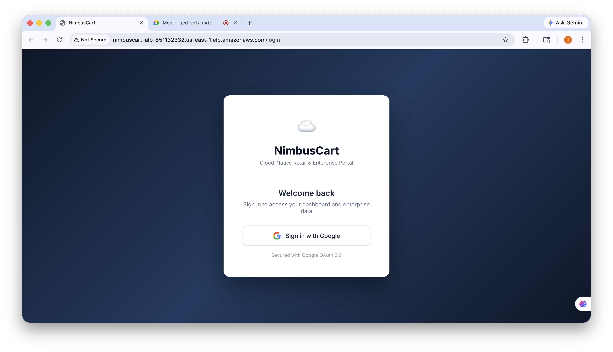

### 2. Customer Product Catalog
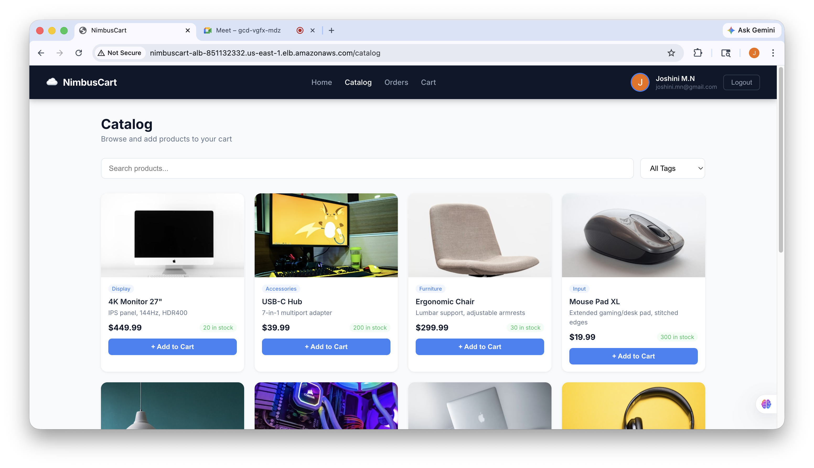

### 3. Shopping Cart
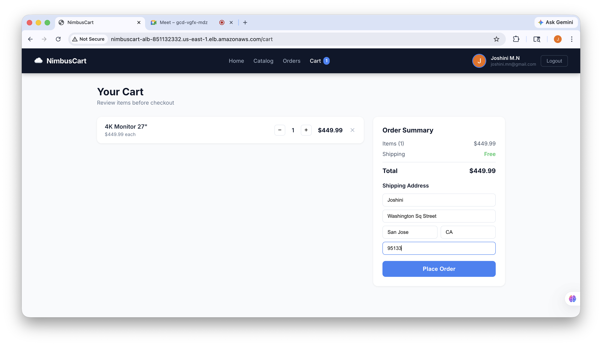

### 4. Customer Order History
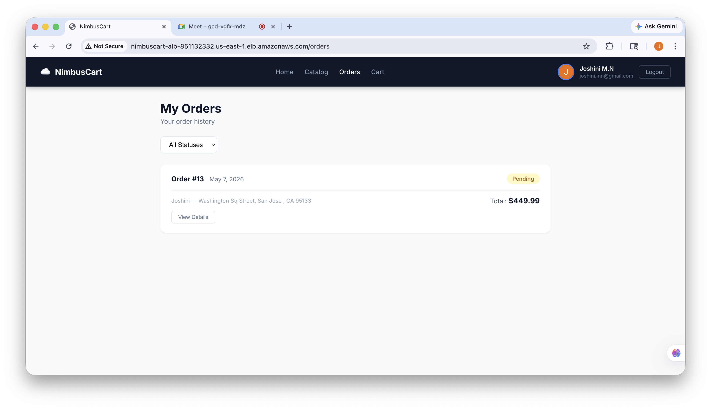

### 5. Admin Enterprise Dashboard
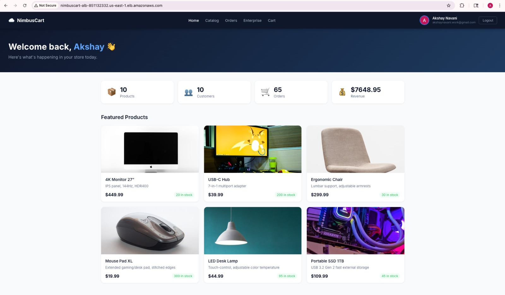

### 6. Category Inventory Management
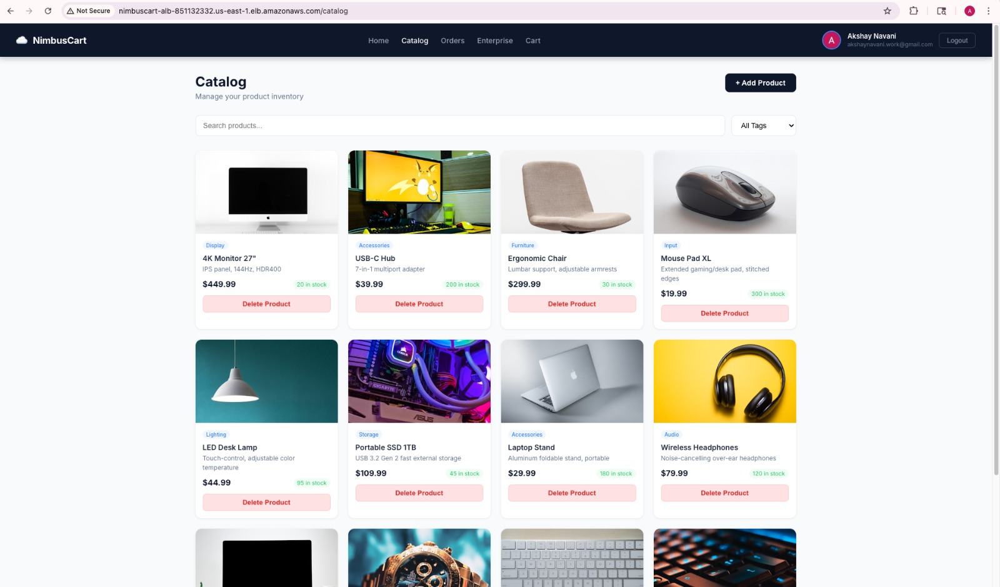

### 7. Enterprise Analytics of Orders
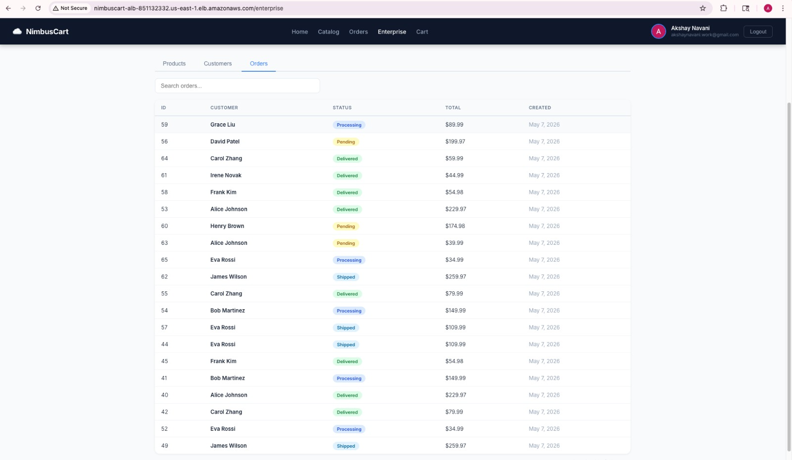

## Architecture

### AWS Cloud Architecture

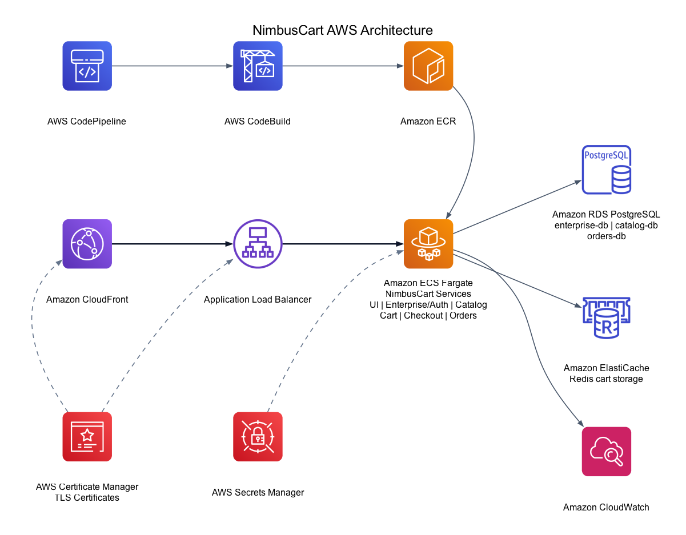

### Application Actors

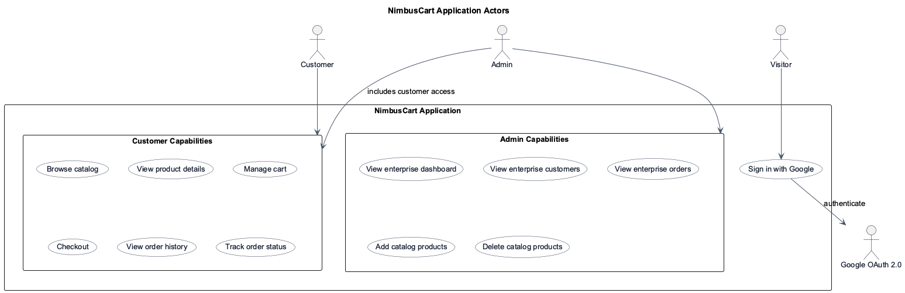

### ALB Path-Based Routing

```
Internet → ALB (internet-facing, HTTP :80)
              │
              ├── /auth/*            → enterprise  :3000  (ECS Fargate)
              ├── /api/enterprise/*  → enterprise  :3000
              ├── /products/*        → catalog     :3001  (ECS Fargate)
              ├── /cart/*            → cart         :3002  (ECS Fargate)
              ├── /checkout/*        → checkout     :3003  (ECS Fargate)
              ├── /orders/*          → orders       :3004  (ECS Fargate)
              └── /* (default)       → ui           :80   (ECS Fargate / nginx)
```

### CDK Stack Resources

| Resource | Config |
|---|---|
| VPC | 2 AZs, 1 NAT Gateway, public + private subnets |
| Security Groups | ALB (80/443), ECS (from ALB + inter-service), DB (5432), Redis (6379) |
| Secrets Manager | App secrets + 3 auto-generated DB passwords |
| RDS PostgreSQL ×3 | enterprise, catalog, orders — db.t3.micro, 20 GB |
| ElastiCache Redis | cache.t3.micro, single node |
| ECR Repos ×6 | Lifecycle: keep last 5 images |
| ECS Fargate ×6 | 256 vCPU / 512 MB, circuit breaker with rollback |
| ALB | Internet-facing, path-based routing |
| IAM | Separate execution + task roles, least-privilege |
| CloudWatch | Per-service log groups, 1-week retention |
| CodePipeline + CodeBuild | Optional — enabled via `githubConnectionArn` context |

## Services

| Service | Port | Data Store | Responsibilities |
|---|---:|---|---|
| `ui` | 5174 | None | Vue 3 frontend SPA |
| `enterprise` | 3000 | PostgreSQL | Google OAuth, JWT, RBAC, enterprise APIs |
| `catalog` | 3001 | PostgreSQL | Product and tag APIs; admin product writes |
| `cart` | 3002 | Redis | Per-user cart storage with 7-day TTL |
| `checkout` | 3003 | None | Fetch cart, create order, clear cart |
| `orders` | 3004 | PostgreSQL | Order history and status tracking |

### Inter-Service Communication

Only `checkout` calls other services. All others are fully independent.

```
checkout → GET    /cart/:userId    (cart service)
checkout → POST   /orders          (orders service)
checkout → DELETE /cart/:userId    (cart service)
```

In production, all inter-service calls go through the ALB. `CART_SERVICE_URL` and `ORDERS_SERVICE_URL` both point to the ALB base URL; path-based routing delivers to the correct service.

## User Roles

| Role | Access |
|---|---|
| `customer` | Browse catalog, manage cart, checkout, view orders, track order status |
| `admin` | Customer access plus enterprise dashboard and catalog product management |

New users are assigned the `customer` role by default. Admin access is granted by updating the user role in the enterprise database.

## Authentication and RBAC

### OAuth + JWT Flow

```
User clicks "Sign in with Google"
  → browser → /auth/google (enterprise service)
  → Google OAuth consent screen
  → /auth/google/callback
  → Passport.js upserts user in enterprise-db
  → JWT signed with JWT_SECRET (7-day expiry)
      payload: { id, email, name, avatar, role }
  → redirect to frontend /?token=JWT
  → Vue router guard captures token → localStorage + Pinia auth store
  → All subsequent API calls: Authorization: Bearer <JWT>
  → Each service validates JWT independently (shared JWT_SECRET)
```

### RBAC Enforcement

| Layer | Mechanism |
|---|---|
| Backend | `requireRole('admin')` middleware on `POST /products`, `DELETE /products/:id`, all `/api/enterprise/*` routes |
| Frontend router | `meta: { requiresRole: 'admin' }` on `/enterprise` route — redirects customers to `/` |
| Frontend UI | `auth.isAdmin` computed — conditionally renders enterprise nav link, stat cards, Add Product form, Delete buttons |

## Database Schemas

**enterprise-db**
```sql
users        (id SERIAL, google_id, email, name, avatar, role DEFAULT 'customer', created_at)
customers    (id SERIAL, name, email UNIQUE, company, phone, created_at)
products     (id SERIAL, name UNIQUE, description, price, stock, image_url, created_at)
orders       (id SERIAL, customer_id FK, status, total, created_at)
order_items  (id SERIAL, order_id FK, product_id, product_name, quantity, unit_price)
```

**catalog-db**
```sql
products      (id SERIAL, name UNIQUE, description, price NUMERIC, stock INT, image_url, created_at)
tags          (id SERIAL, name VARCHAR UNIQUE)
product_tags  (product_id FK, tag_id FK, PRIMARY KEY(product_id, tag_id))
```

**orders-db**
```sql
orders             (id SERIAL, user_id, status, total NUMERIC, created_at)
order_items        (id SERIAL, order_id FK, product_id, product_name, quantity, unit_price)
shipping_addresses (id SERIAL, order_id FK, name, street, city, state, zip, country)
```

**Redis**
```
Key:   cart:{user_id}
Value: JSON → [{ productId, name, price, quantity }]
TTL:   7 days (reset on every write)
```

## Local Development

### Prerequisites

- Docker
- Docker Compose
- Node.js and npm, if running services outside Docker
- Google OAuth 2.0 client credentials

### Setup

Create the enterprise environment file:

```bash
cp services/enterprise/.env.example services/enterprise/.env
```

Update `services/enterprise/.env`:

```env
GOOGLE_CLIENT_ID=your-google-client-id
GOOGLE_CLIENT_SECRET=your-google-client-secret
GOOGLE_CALLBACK_URL=http://localhost:3000/auth/google/callback
JWT_SECRET=your-shared-jwt-secret
SESSION_SECRET=your-session-secret
FRONTEND_URL=http://localhost:5174
```

Use the same `JWT_SECRET` for all backend services.

### Google OAuth Setup

1. Go to [Google Cloud Console](https://console.cloud.google.com) → APIs & Services → Credentials
2. Create an OAuth 2.0 Client ID (Web application)
3. Authorized JavaScript origins: `http://localhost:3000`
4. Authorized redirect URIs: `http://localhost:3000/auth/google/callback`
5. Paste Client ID + Secret into `services/enterprise/.env`

### Run with Docker Compose

```bash
docker compose up --build
```

Application URL:

```text
http://localhost:5174
```

## AWS Deployment

Infrastructure is defined with AWS CDK in the `infrastructure/` directory.

The stack provisions ECS Fargate services, RDS PostgreSQL databases, ElastiCache Redis, ECR repositories, an Application Load Balancer, Secrets Manager, CloudWatch logs, and optional CodePipeline/CodeBuild CI/CD.

## Cloud Infrastructure Screenshots

### ECS Services
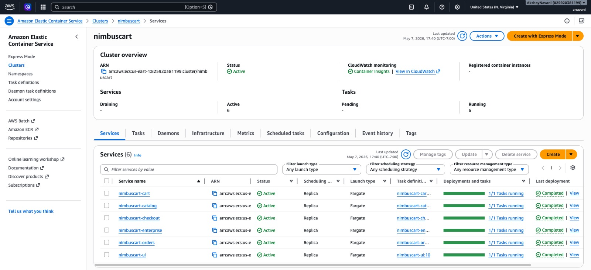

### RDS Databases
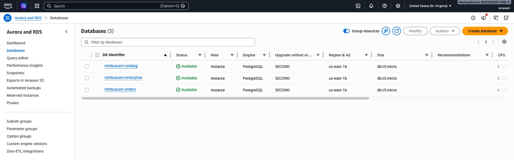

### ElastiCache Redis
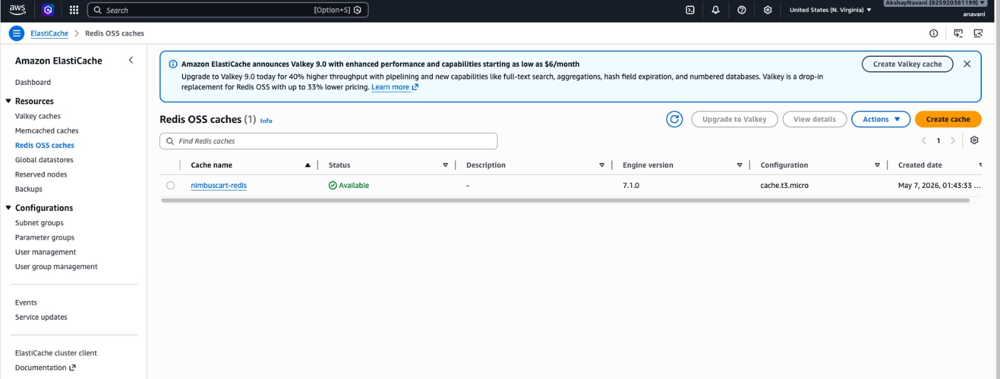

### Secrets Manager
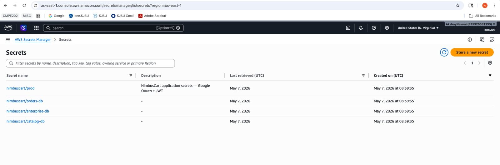

### CloudFormation Stack
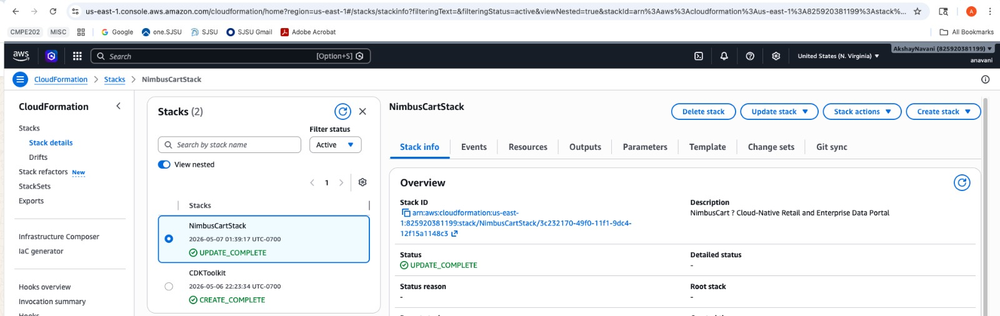

### Deploy (two-pass for UI URL)

```bash
cd infrastructure && npm install

# 1st deploy — creates all infrastructure
npx cdk deploy \
  -c googleClientId=<ID> \
  -c googleClientSecret=<SECRET> \
  -c jwtSecret=<STRONG_RANDOM_SECRET> \
  -c sessionSecret=<STRONG_RANDOM_SECRET>

# Copy AlbUrl from stack outputs
# Add http://<ALB_DNS>/auth/google/callback to Google Cloud Console

# 2nd deploy — rebuilds UI with real API base URL baked in
npx cdk deploy \
  -c albUrl=http://<ALB_DNS_FROM_OUTPUT> \
  -c googleClientId=<ID> \
  -c googleClientSecret=<SECRET> \
  -c jwtSecret=<SAME_AS_ABOVE> \
  -c sessionSecret=<SAME_AS_ABOVE>
```

> **Why two passes?** The Vue UI bakes `VITE_*` API URLs at Docker build time. The ALB DNS is only known after the first deploy. The second deploy rebuilds the UI image with the real URL.

## CI/CD Pipeline

```
git push origin main
        │
        ▼
AWS CodePipeline (Source — GitHub webhook)
        │
        ▼
AWS CodeBuild (buildspec.yml)
  ├── ECR login
  ├── docker build × 6 services
  ├── docker push → ECR (nimbuscart-*)
  └── aws ecs update-service --force-new-deployment × 6
        │
        ▼
ECS rolling deploy → live at ALB URL
```

Sensitive values (Google OAuth, JWT secrets) are pulled from Secrets Manager at CodeBuild time — never stored in plaintext.

## Repository Structure

```text
NimbusCart/
├── diagrams/                 # Architecture and actor diagrams
├── infrastructure/           # AWS CDK infrastructure
├── screenshots/              # Application and cloud screenshots
├── services/
│   ├── ui/                   # Frontend application
│   ├── enterprise/           # Auth, RBAC, enterprise APIs
│   ├── catalog/              # Product catalog service
│   ├── cart/                 # Cart service
│   ├── checkout/             # Checkout orchestration service
│   └── orders/               # Orders service
├── buildspec.yml             # AWS CodeBuild build spec
├── docker-compose.yml        # Local development stack
└── README.md
```

### [Project Report](reports/NimbusCart_Project_Report.docx)
### [HTML Project Report](reports/NimbusCart_Project_Report.html)
